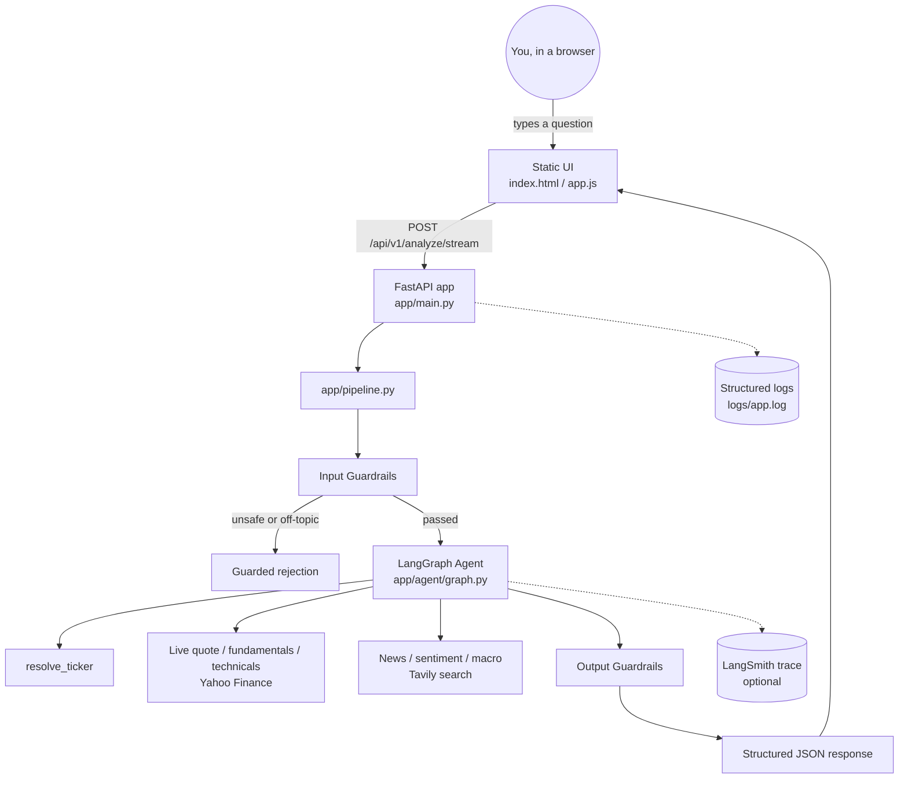
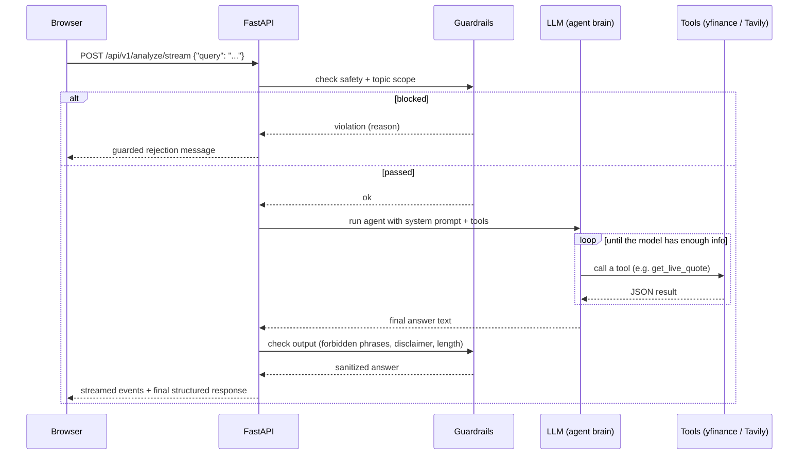
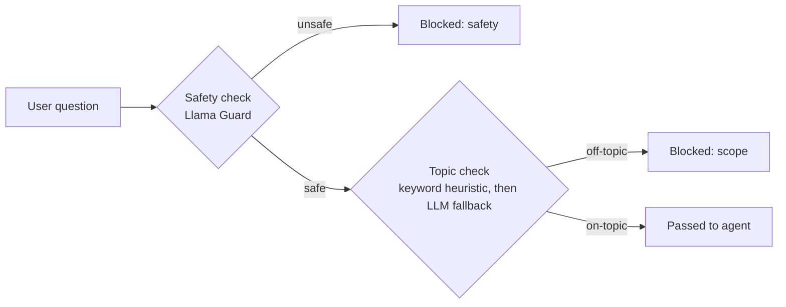
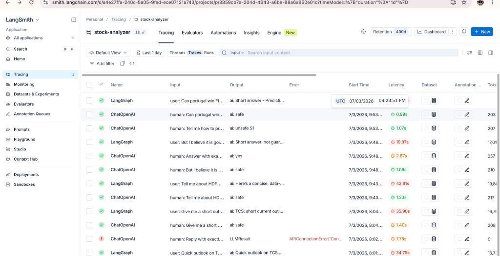
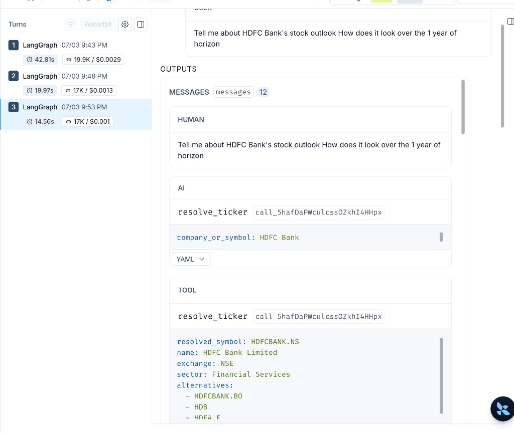
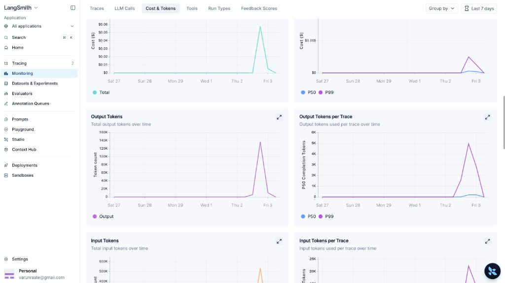

# TradeSetu — Agentic Stock Analyzer

A student tutorial: **build a real, production-shaped agentic AI web app**
from zero — an assistant that takes a plain-English question like *"Tell me
about TCS stock, what's its potential right now?"*, resolves the ticker,
pulls **live** market data, searches the web, and returns a grounded
recommendation — through a FastAPI backend with logging, guardrails, and a
browser UI.

This README is written so a **newbie can follow it top-to-bottom on their own
machine** and understand not just *what* to type, but *why* each piece
exists.

> No UI screenshot is included — a generated mockup wouldn't accurately
> represent the real thing. Run the app (Section 5) and see it yourself: a
> dark, chat-style interface, not a dashboard of static cards. Real
> **observability** screenshots from this app's actual LangSmith project —
> traces, cost, and an error caught in production — are in Section 7.

---

## Table of contents

1. [What you're building, and why](#1-what-youre-building-and-why)
2. [Architecture at a glance](#2-architecture-at-a-glance)
3. [Prerequisites](#3-prerequisites)
4. [Step-by-step build tutorial](#4-step-by-step-build-tutorial)
5. [Run it](#5-run-it)
6. [Test it — a guided walkthrough](#6-test-it--a-guided-walkthrough)
7. [Watching it think: logs & LangSmith tracing](#7-watching-it-think-logs--langsmith-tracing)
8. [Troubleshooting](#8-troubleshooting)
9. [Glossary — concepts used in this app](#9-glossary--concepts-used-in-this-app)
10. [Exercises — extend it yourself](#10-exercises--extend-it-yourself)

---

## 1. What you're building, and why

This app maps five production AI-engineering skills onto one working system:

| Skill (the "why") | Where it lives (the "what") |
|---|---|
| **Logging** model & system behavior | `app/logging_config.py` — every request gets a `trace_id`, every step writes a structured JSON log line |
| **Handling runtime errors** in AI pipelines | `app/errors.py` — LLM/search/data failures are caught and turned into safe messages, never a raw crash |
| **FastAPI endpoints** for AI apps | `app/main.py` — real HTTP routes: `/health`, `/api/v1/analyze`, `/api/v1/analyze/stream` |
| **Request/response structure** for production | `app/schemas.py` — every request and response is validated against a strict schema (Pydantic) |
| **Guardrails** against unsafe/invalid outputs | `app/guardrails/` — blocks unsafe input, blocks off-topic input, cleans up risky output |

On top of that, it's a genuinely **agentic** system: the LLM decides *which
tools to call and in what order* — it isn't a fixed if/else script. That's
powered by **LangGraph** (`app/agent/graph.py`), the same pattern used in the
teaching notebooks in the parent folder.

---

## 2. Architecture at a glance

### 2.1 System components



### 2.2 What happens on every request (sequence)



### 2.3 Two-layer guardrail design (the important teaching point)

A single safety filter is **not enough** — it catches harmful content but
not off-topic content. This app uses two independent layers:



`"How do I make a bomb?"` → caught by **safety**.
`"What's the capital of France?"` → safe, but caught by **scope**.
Only genuinely safe *and* on-topic questions reach the agent.

> **Real lesson — malformed model output:** open-weight "reasoning" models
> like `gpt-oss` use an internal chat format ("harmony") separating
> reasoning/tool-call/final-answer sections. The serving backend usually
> parses this into clean `tool_calls` — but occasionally the model leaks
> raw markup (`<|channel|>...<|message|>`) with **fabricated results** and
> zero real `tool_calls`. A naive pipeline would show that garbage as the
> final answer. `app/pipeline.py` detects these markers
> (`MALFORMED_OUTPUT_MARKERS`) and retries automatically
> (`MAX_AGENT_RETRIES`, tuned from a measured ~7% per-turn failure rate —
> see `docs/test_maas_tool_parsing.py`), verified both live and with a
> mocked retry test. **Lesson:** never trust LLM output just because
> `tool_calls` is empty — validate the shape of what came back.

> **Why the main LLM provider changed:** this app originally ran MaaS-hosted
> `gpt-oss-120b`. The diagnostic above measured a ~7% per-turn failure rate,
> reproduced via raw curl *and* the real production agent with wire-level
> capture — including one perfectly well-formed request that still got back
> `finish_reason: "tool_calls"` with **non-null, fabricated** content: a
> protocol violation, not a bug on our side. We moved the main LLM to
> OpenAI's `gpt-5-nano` (cheapest tool-calling-capable model) and kept
> **Llama Guard on the original MaaS endpoint**, since it showed no issues —
> proving the two concerns can use entirely different providers with zero
> coupling, because `app/llm.py` treats them as independent clients from
> day one.

> **Real lesson — a guardrail conflicting with the app's own purpose:**
> Llama Guard's `S6: Specialized Advice` category flags financial/medical/
> legal advice-seeking text as "unsafe" by default — e.g. *"Should I buy or
> sell TCS stock?"* — a direct conflict with this app's purpose. The fix
> wasn't removing the safety check; it's recognizing the **output guardrail
> already enforces** what `S6` protects against (disclaimer, hedged
> language, no guarantee claims). So `S6` is explicitly allowlisted
> (`ALLOWED_SAFETY_CATEGORIES` in `policies.py`) while every other category
> still hard-blocks. **Lesson:** test guardrails against your own domain's
> real questions, not just obviously-bad examples.

---

## 3. Prerequisites

- **Python 3.10+** installed (`python3 --version` to check)
- A terminal (macOS Terminal, iTerm, or the one built into your editor)
- Basic comfort running `pip install` and `python -m ...` commands
- API access to:
  - An **LLM provider** with tool-calling support, reachable via an OpenAI-compatible URL (this project uses a MaaS endpoint, but any OpenAI-compatible provider works)
  - A **safety-classifier model** (this project uses Llama Guard 3)
  - A **[Tavily](https://tavily.com)** API key (free tier available) for web search
  - *(Optional)* A **[LangSmith](https://smith.langchain.com)** account (free tier) for trace visualization

You do **not** need Docker, a database, or any system-level software — everything runs as plain Python processes inside a virtual environment.

---

## 4. Step-by-step build tutorial

This section walks through the app **in the order it was actually built**,
so you understand the dependency chain: config → tools → agent → guardrails
→ API → UI. Each step references the real file so you can open it side by
side.

### Step 1 — Project skeleton & virtual environment

```bash
mkdir stock_analyzer && cd stock_analyzer
python3 -m venv .venv          # or reuse a shared venv, as this project does
source .venv/bin/activate
mkdir -p app/agent app/guardrails static logs
touch app/__init__.py app/agent/__init__.py app/guardrails/__init__.py
```

**Why a virtual environment?** It isolates this project's Python packages
from your system Python — nothing gets installed system-wide.

### Step 2 — Secrets in `.env`, never in code

Create `.env` (copy from `.env.example`) with your real keys, and make sure
`.gitignore` excludes it:

```env
LLM_BASE_URL=https://api.openai.com/v1
LLM_API_KEY=your-llm-key
LLM_MODEL=your-model-name
GUARD_BASE_URL=https://your-guardrail-provider/v1
GUARD_API_KEY=your-guard-key
GUARD_MODEL=your-guard-model-name
TAVILY_API_KEY=your-tavily-key
LANGSMITH_TRACING=false
```

Note the main LLM and the guardrail model each have their **own**
`_BASE_URL`/`_API_KEY`/`_MODEL` — they're independent clients on purpose, so
they can live on entirely different providers (see the callout in section 2.3).

**Why this matters:** hardcoded keys end up in git history, screenshots, and
error logs. A `.env` file that's gitignored is the standard fix — see
`app/config.py` for how it's loaded:

```python
from dotenv import load_dotenv
load_dotenv(Path(__file__).resolve().parent.parent / ".env")
```

### Step 3 — Central config (`app/config.py`)

One small module reads every environment variable once, and fails loudly and
early if something required is missing:

```python
def _require(name: str) -> str:
    value = os.getenv(name)
    if not value:
        raise RuntimeError(f"Missing required environment variable: {name}")
    return value
```

Every other module imports `settings` from here — nobody else calls
`os.getenv` directly. This is what lets you swap providers by editing one
file (`.env`) instead of hunting through the codebase.

### Step 4 — Structured logging (`app/logging_config.py`)

Before writing any business logic, set up logging — you'll want it from the
very first test run. Every log line is a JSON object, and every one carries
a `trace_id`:

```python
def log_event(logger, level, message, trace_id="", **fields):
    getattr(logger, level.lower())(message, extra={"trace_id": trace_id, "extra_fields": fields})
```

**Why JSON, not plain text?** Structured logs can be grepped, filtered, and
fed into dashboards. `grep trace_id logs/app.log` instantly shows every step
of one specific request.

### Step 5 — The LLM factory (`app/llm.py`)

A tiny wrapper so the rest of the app never imports a provider SDK directly:

```python
def get_llm(temperature: float = 0.1) -> ChatOpenAI:
    return ChatOpenAI(
        base_url=settings.llm_base_url,
        api_key=settings.llm_api_key,
        model=settings.llm_model,
        temperature=temperature,
    )
```

Because most LLM gateways (including this project's) are **OpenAI-compatible**,
`ChatOpenAI` with a custom `base_url` works regardless of which model is
actually behind it. A second function, `get_guard_llm()`, does the same for
the safety-classifier model — kept as a *separate* client because it uses a
different key/model and is never used for reasoning, only classification.

### Step 6 — Tools: the agent's hands

Tools are plain Python functions decorated with `@tool` — the docstring
*is* the schema the LLM reads to decide when to call it.

**6a. Ticker resolution** (`app/agent/tools_ticker.py`) — turns "Reliance" or
"TCS" into a real Yahoo Finance symbol using `yfinance`'s live search, no
hardcoded name→symbol map:

```python
@tool
def resolve_ticker(company_or_symbol: str) -> str:
    """Resolve a company name or partial symbol to a valid Yahoo Finance ticker."""
    search = yf.Search(company_or_symbol, max_results=8)
    candidates = [c for c in search.quotes if c.get("quoteType") == "EQUITY"]
    ...
```

**6b. Market data** (`app/agent/tools_market.py`) — `get_live_quote`,
`get_fundamental_snapshot`, `get_technical_snapshot` (RSI-14, SMA-20/50
computed live from price history), `get_price_history`. Every number is
fetched or computed at call time — nothing is hardcoded.

**6c. Research** (`app/agent/tools_research.py`) — `search_stock_news`,
`search_market_sentiment`, `search_global_macro_impact`, each wrapping
Tavily with a focused, pre-built query template.

**Test a tool in isolation before wiring it into anything:**
```bash
python -c "from app.agent.tools_market import get_live_quote; print(get_live_quote.invoke({'symbol': 'TCS.NS'}))"
```

### Step 7 — The agent (`app/agent/graph.py`)

This is where "agentic" actually happens. `create_agent` (from LangChain,
backed by LangGraph) wires a loop: *model decides → tool runs → model
decides again → ... → final answer*. You provide the model, the tool list,
and a system prompt — the loop itself is handled for you:

```python
SYSTEM_PROMPT = """You are TradeSetu's stock research assistant...
1. If the user gives a company name instead of an exact symbol, call resolve_ticker first.
2. Always ground every price, ratio, or indicator in a tool result — never guess.
...
5. Always include this exact disclaimer at the end: "This is not SEBI-registered investment advice..."
"""

_agent = create_agent(get_llm(), ALL_TOOLS, system_prompt=SYSTEM_PROMPT, checkpointer=InMemorySaver())
```

The `checkpointer` gives the agent short-term memory across turns if you
reuse the same `thread_id` — useful for a follow-up question in the same
session.

### Step 8 — Guardrails (`app/guardrails/`)

**8a. Input — safety** (`input_guard.py`): send the raw user text to the
Llama Guard model. It replies `safe` or `unsafe\nS<category>`:

```python
verdict = get_guard_llm().invoke(text).content.strip().lower()
is_unsafe = verdict.startswith("unsafe") or "\nunsafe" in verdict
```

**8b. Input — scope**: a cheap keyword check first (fast, free); only if
that's inconclusive, ask the main LLM "is this about stocks/investing?"
before blocking — this two-tier design keeps most requests fast while still
catching edge cases the keyword list misses.

**8c. Output** (`output_guard.py`): after the agent answers, scan for
forbidden phrases ("guaranteed returns", "risk-free", ...), redact them if
found, append the disclaimer if missing, and cap the response length.

**Why guardrails live in their own folder, separate from the agent:** you
want to be able to change *what's allowed* (`policies.py`) without touching
*how the agent reasons* (`graph.py`). Keeping rules and enforcement code
separate also makes it easy for a newbie to find and tweak the rules without
reading agent internals.

### Step 9 — The FastAPI app

**9a. Schemas first** (`app/schemas.py`) — define the shape of every request
and response *before* writing the routes. `AnalyzeRequest` and
`AnalyzeResponse` are Pydantic models; FastAPI validates every request
against them automatically (try sending an empty `query` and see a `422`
with zero extra code from you).

**9b. One shared pipeline** (`app/pipeline.py`) — both the synchronous and
the streaming endpoint call the *same* `run_input_guardrails → agent →
apply_output_guardrails` sequence, so they can never drift apart:

```python
def run_pipeline(query, thread_id, trace_id) -> AnalyzeResponse:
    run_input_guardrails(query, trace_id)      # may raise GuardrailViolation
    result = get_agent().invoke({"messages": [("user", query)]}, ...)
    sanitized, events = apply_output_guardrails(result["messages"][-1].content, trace_id)
    return AnalyzeResponse(...)
```

**9c. Routes + error handling + logging middleware** (`app/main.py`) — a
middleware assigns a `trace_id` to every request and logs start/finish with
duration; a custom exception handler turns any `AppError` into a clean JSON
error instead of a stack trace.

**9d. Streaming** — `POST /api/v1/analyze/stream` iterates
`agent.stream(..., stream_mode="updates")`, which yields each tool call as
it happens, and forwards it to the browser as Server-Sent Events. This is
what powers the live "agent activity" panel in the UI.

### Step 10 — The UI (`static/`) — a real conversation, not one-shot analysis

Plain HTML/CSS/JS — **no build step**, so you can open `index.html`,
`style.css`, and `app.js` directly and read every line. It's a **chat
interface**, not a single-query dashboard: every message you send is
appended to the same conversation, and the agent remembers prior turns.

The key mechanic is a `thread_id` generated once per conversation
(`crypto.randomUUID()` in `app.js`) and sent with every request:

```javascript
let threadId = crypto.randomUUID();  // one per conversation

body: JSON.stringify({ query, thread_id: threadId }),
```

The backend's agent already has a checkpointer (`InMemorySaver`, see Step 7
in `app/agent/graph.py`) keyed by `thread_id` — so reusing the same ID across
requests is *the entire mechanism* for multi-turn memory. Clicking
**"+ New chat"** just generates a fresh `threadId` and clears the visible
message list — nothing more.

For each turn, `app.js` does three things: appends a user bubble
immediately, streams `/api/v1/analyze/stream` events into a live "agent
activity" list inside the assistant's bubble as tools fire, then replaces
that list with the final rendered markdown answer (via `marked.js`,
sanitized with `DOMPurify`) plus guardrail/tool-usage badges.

---

## 5. Run it

```bash
cd stock_analyzer
pip install -r requirements.txt
cp .env.example .env      # then fill in your real keys
python -m uvicorn app.main:app --reload --port 8000
```

Open **http://127.0.0.1:8000** in your browser.

> Run this in your own terminal window and leave it running — the server
> needs to stay alive while you use the UI.

---

## 6. Test it — a guided walkthrough

### Single-turn queries (verified working)

Try these one at a time (each as a fresh "+ New chat") and watch the "agent
activity" trace inside the assistant's reply:

| # | Try typing | What you should see |
|---|---|---|
| 1 | `Tell me about TCS stock, what's its potential right now?` | `resolve_ticker` fires first, then most/all of the market + research tools, then a full structured answer ending in a disclaimer |
| 2 | `Should I look at Reliance shares?` | Same flow, different ticker — the recommendation is phrased as a *leaning* (e.g. "leaning Hold"), never a command |
| 3 | `Give me a full analysis of Infosys stock` | All 7-8 tools typically fire — fundamentals, technicals, news, sentiment, macro |
| 4 | `What's the outlook for HDFC Bank?` | Full analysis, same pattern |
| 5 | `Analyze Tata Motors stock potential` | Full analysis on a different sector (auto) |
| 6 | `What is the capital of France?` | Blocked immediately — flagged as off-topic (scope guardrail) |
| 7 | Anything violent or harmful | Blocked immediately — flagged for safety (Llama Guard) |
| 8 | `Should I buy or sell TCS stock?` | **Allowed**, not blocked — see the `S6` callout in Section 2.3 for why this specific phrasing needed a deliberate guardrail exception |
| 9 | `Tell me about stock XYZABC123NOTREAL` | The agent tries `resolve_ticker`, fails to find a match, and asks you to clarify instead of guessing a price |

### A real conversation (this is the point of the chat UI)

Send these **in the same chat**, one after another, without starting a new
conversation:

1. `Tell me about TCS stock`
2. `What about its dividend yield specifically?`
3. `Compare that to its RSI right now`

Notice turns 2 and 3 never repeat "TCS" — the agent already knows which
stock you mean, because both requests reuse the same `thread_id` and the
LangGraph checkpointer keeps the full message history. This was verified
directly: turn 2 correctly answered *"dividend yield: about 6.0%... from the
live fundamental snapshot for TCS.NS"* with zero mention of the company name
in the follow-up question.

Click **"+ New chat"** to reset — the next message starts a brand-new
`thread_id` with no memory of the previous conversation.

After each assistant reply, the small badges at the bottom of that message
show exactly which guardrail checks ran and their result (e.g.
`output_phrase: clean`, `disclaimer: present`).

---

## 7. Watching it think: logs & LangSmith tracing

### Structured logs

```bash
tail -f logs/app.log
```

Every line is JSON. Find everything about one specific request:
```bash
grep "<trace_id>" logs/app.log
```
The `trace_id` is also returned in the `X-Trace-Id` response header and
shown in the UI's result card.

### LangSmith (optional, if you enabled it)

If `.env` has `LANGSMITH_TRACING=true` plus a valid `LANGSMITH_API_KEY` and
`LANGSMITH_PROJECT`, tracing is **automatic** — no code changes needed,
because LangChain/LangGraph read those environment variables on their own.

1. Go to **[smith.langchain.com](https://smith.langchain.com)** and sign in
2. Open the project matching your `LANGSMITH_PROJECT` value
3. Ask a question in the UI, then refresh — you'll see a new trace: the
   agent's reasoning steps, each tool call with inputs/outputs, latency per
   step, and the final answer

This is the single best way to *see* what "agentic" actually means — you're
watching the model decide, in real time, which tool to call next.

### What this actually looks like — real traces from this app

These are screenshots from this project's own LangSmith dashboard, not
staged examples.

**The traces list** — every request run through the app, in order, with
latency and errors visible at a glance:



Two rows worth pointing out, because both are exactly what tracing is *for*:
- `Tell me how to pr...` → `ai: unsafe S1` — a real request the **safety
  guardrail** blocked before the agent ever ran (1.07s, no tool calls)
- `Reply with exactl...` → `Error: APIConnectionError` — a real transient
  upstream failure, caught and handled rather than crashing the app (this is
  the "handle runtime errors in AI pipelines" objective, visible as an
  actual production event, not a hypothetical)

**Drilling into one trace** — a 3-turn HDFC Bank conversation in the same
thread, each turn showing latency, token count, and cost:



Real, measured numbers from that conversation:

| Turn | Latency | Tokens | Cost |
|---|---|---|---|
| 1 — "Tell me about HDFC Bank's stock outlook..." | 42.8s | 19.9K | $0.0029 |
| 2 — follow-up in the same thread | 20.0s | 17K | $0.0013 |
| 3 — follow-up in the same thread | 14.6s | 17K | $0.0010 |

Notice latency and cost **drop** on later turns — the agent already has
prior tool results in context, so it calls fewer tools to answer a
follow-up. The expanded message view shows the actual mechanics: the `AI`
message calls `resolve_ticker(company_or_symbol="HDFC Bank")`, and the
`TOOL` message returns the real resolved symbol (`HDFCBANK.NS`), exchange,
sector, and alternates — exactly the JSON contract described in Step 6.

At **$0.0029 for the most expensive turn**, a full classroom session of a
few dozen queries costs a small fraction of a cent — this is what "cheapest
model that still supports tool calling" (Section 2.3) looks like in
measured reality, not just a pricing page.

**The monitoring dashboard** — cost and token usage aggregated over time,
useful for spotting a runaway loop or an unexpectedly expensive query:



---

## 8. Troubleshooting

| Symptom | Likely cause | Fix |
|---|---|---|
| `Missing required environment variable: ...` on startup | `.env` incomplete | Check every key in `.env.example` is present in your `.env` |
| Requests hang for a long time | LLM/Tavily is genuinely working — a full analysis calls 5-6 tools sequentially | Normal; usually 15-30 seconds. Watch the "Agent activity" panel for progress |
| Everything gets blocked as "off-topic" | Your question has no finance keywords **and** the LLM scope check disagreed | Rephrase mentioning a company, ticker, or the word "stock"/"invest" |
| `422` error on submit | Empty or >500-character query | Pydantic validation — shorten or fill in the question |
| A normal stock question gets blocked as "unsafe" | Llama Guard's `S6: Specialized Advice` category flags financial-advice phrasing by default | Already fixed in this codebase — see `ALLOWED_SAFETY_CATEGORIES` in `app/guardrails/policies.py` and the callout above. If you add a new safety-classifier model, re-test this scenario |
| Answer contains raw text like `<|channel|>analysis<|message|>...` with fabricated numbers | The underlying model occasionally leaks its internal "harmony" chat-template format instead of a real tool call — see the callout below | Already fixed — `app/pipeline.py` detects this and automatically retries (`MAX_AGENT_RETRIES` in `policies.py`) before ever showing it to the user |
| Port already in use | A previous run is still listening on 8000 | `lsof -i :8000` to find the PID, then stop it, or use `--port 8001` |
| Browser shows blank page | Server not running, or wrong port | Confirm the terminal shows `Application startup complete` and you're on the same port |

---

## 9. Glossary — concepts used in this app

| Term | In one sentence |
|---|---|
| **Tool calling / function calling** | The LLM returns a structured request ("call `get_live_quote` with `symbol=TCS.NS`") instead of guessing an answer in plain text |
| **Agent** | An LLM that can call tools, look at the result, and decide the *next* action — repeated until it has enough information to answer |
| **Guardrail** | A rule enforced in code (not just a prompt instruction) that blocks or sanitizes input/output |
| **Trace / tracing** | A recorded timeline of every step a request took — which tools ran, in what order, how long each took |
| **`trace_id`** | A unique ID generated per request so you can find every log line and trace related to that one request |
| **Structured logging** | Writing logs as machine-parseable JSON instead of free-text sentences |
| **Streaming (SSE)** | Sending partial results to the browser as they happen, instead of making the user wait for the entire response |
| **Checkpointer** | What LangGraph uses to remember prior messages in the same conversation thread |
| **OpenAI-compatible endpoint** | An API that accepts the same request/response shape as OpenAI's, even if a different model is actually running behind it |

---

## 10. Exercises — extend it yourself

1. **New tool:** Add `compare_peers(symbol, peer)` to `tools_market.py` that
   fetches two fundamental snapshots side by side. Register it in
   `graph.py`'s `ALL_TOOLS` list and ask the agent to compare two stocks.
2. **New guardrail rule:** Add a phrase to `FORBIDDEN_OUTPUT_PHRASES` in
   `policies.py` (e.g. `"can't go wrong"`) and confirm the output guardrail
   catches it.
3. **Multi-turn memory:** Reuse the same `thread_id` across two calls to
   `/api/v1/analyze` and ask a follow-up question like "What about its
   dividend?" without repeating the company name.
4. **New scope keyword:** Add a term to `STOCK_SCOPE_KEYWORDS` and test that
   a previously-blocked phrasing now passes the fast heuristic path.
5. **Swap providers:** Point `LLM_BASE_URL`/`LLM_MODEL` at a different
   OpenAI-compatible provider — confirm the rest of the app needs zero code
   changes. (This app actually did this for real — see the "Why the main LLM
   provider changed" callout in section 2.3.)

---

*Educational project. Not SEBI-registered investment advice. All analysis is generated by an LLM grounded in live third-party data (Yahoo Finance, Tavily) and may be inaccurate or incomplete.*
